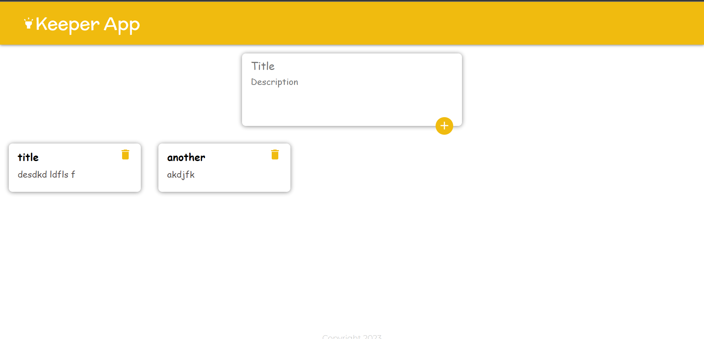
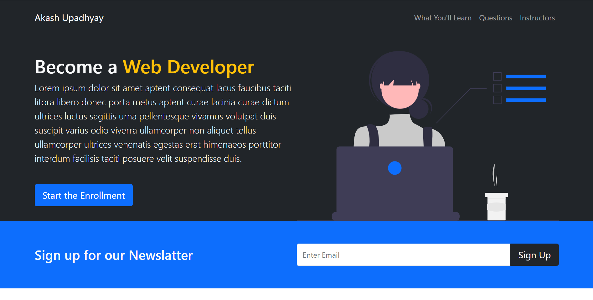
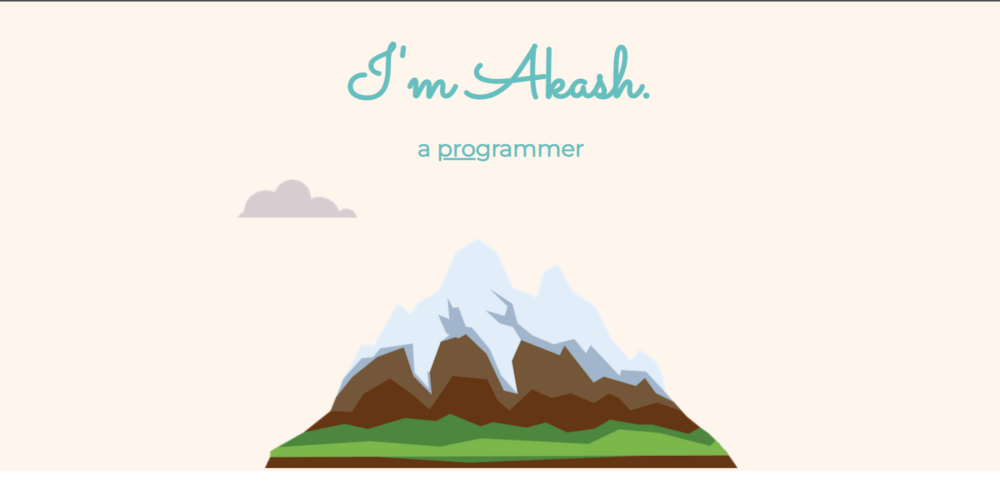

## Keeper App
Created a clone of Google Keep Notes using React hooks, a simple and beautiful UI. With functionalities to add and delete notes.
- 
- Tags: Category 1
- Badges:
  - React [blue]
- Buttons:
  - Live Demo [https://kamalup-dev.github.io/keeper-app/]

## Bootstrap Responsive Tech Website
Created this frontend website with bootstrap 5. It is completely responsive for Mobiles, Tablets and PCs.
- 
- Tags: Category 2
- Badges:
  - Bootstrap 5 [blue]
  - HTML [blue]
  - CSS [blue]
  - JavaScript [blue]
- Buttons:
  - Live Demo [https://kamalup-dev.github.io/bs/#]

## Portfolio
A minimal portfolio website created using HTML, CSS and JavaScript.
- 
- Tags: Category 3
- Badges:
  - HTML 5 [blue]
  - CSS 3 [blue]
  - JavaScript [blue]
- Buttons:
  - Link [https://kamalup-dev.github.io/kamal-tech/]